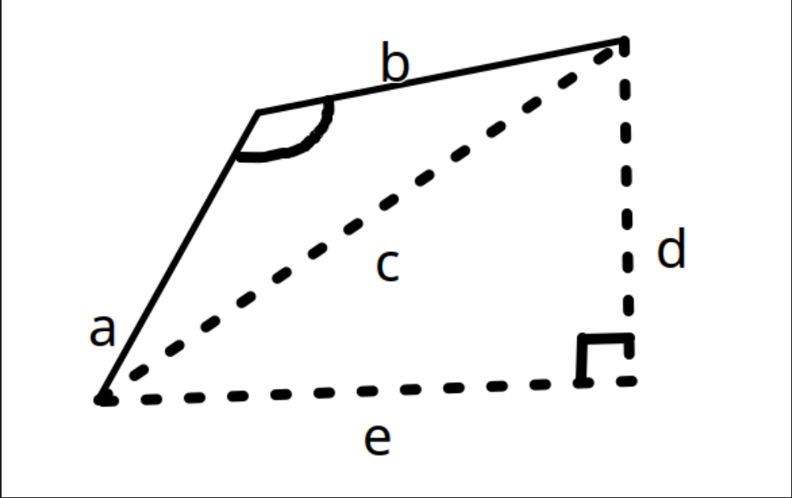

# Location Tracking - getTurnAngle

Use this formula to get the angle needed to make the turn:

$$
\Large
\gamma = \arccos(\dfrac{a^2+b^2-c^2}{2ac})
$$

This is just rearranging the law of cosines which usually looks like this:

$$
\Large
c^2=a^2+b^2-2ac(\cos\gamma)
$$

**a** = the distance from the previous point to the midpoint

**b** = the distance from the midpoint to the next point

**c** = the distance from the previous point directly to the next point
gamma = the angle i need

But now how do we get c?

We get c by drawing imaginary lines along their respective axes until they intersect thus forming a right triangle, then we can get the hypotenuse of that right triangle to get the length c like so:



We can only really get away with this because we are working on a coordinate system

So the full formula looks kinda like this:

$$
\Large
\gamma = \arccos(\dfrac{a^2+b^2-(d^2 + e^2)}{2a(\sqrt{d^2 + e^2})})
$$

But I don't wanna look at this formula like this so, we'll stick to this:

$$
\Large
\gamma = \arccos(\dfrac{a^2+b^2-c^2}{2ac})
$$

And we express this function with this code:

```
turnAngle = math.acos(((distA**2) + (distB**2) - (distC**2))/(2 * distA * distC))
```

Notice how we still express this in terms of _a_, _b_, and _c_. Rather than the formula with _d_ and _e_ shown before.

This is because we have distC which has to go through this calculation first:

```
# Calculate the distance
xDistComponent = abs(coords2[0] - coords1[0])
yDistComponent = abs(coords2[1] - coords1[1])

distance = math.sqrt((xDistComponent**2) + (yDistComponent**2))
```

And if you want to know why there's an absolute value, that's because distance is a scalar that doesn't have a negative value

And if you area also wondering why the values inside the absolute values are written like that, that's because each coordinate tuple/array looks like this:

```
coords1 = (x, y)
```

And we get the values of each index by calling it like this:

```
coords1[0]
```

And since in Python, tuples/arrays are zero-indexed (meaning that they start with the index 0 rather than 1), 0 will represent the x-component and 1 will represent the y-component
